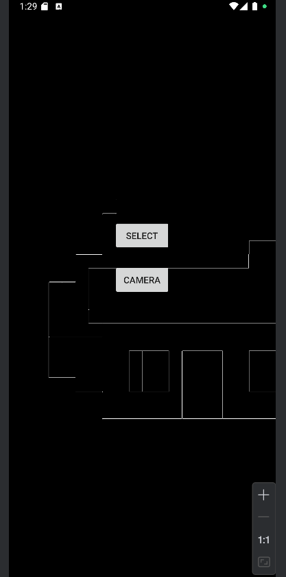

# EdgeDetectionApp 📱

An Android application for real-time edge detection using the device camera and OpenCV.

## 🚀 Features

- 📷 Access camera for live image processing.
- 🖼️ Select images from gallery.
- ⚙️ Apply Canny edge detection using OpenCV.
- 🧠 Native C++ integration via JNI.
- 🔍 Converts images to grayscale and highlights edges.

## 🧰 Tech Stack

- Java (Android)
- OpenCV (Native C++)
- JNI (Java Native Interface)
- Android Studio
- Git & GitHub

## 🖼️ Screenshots




## 🛠️ Setup Instructions

1. Clone this repository:
   ```bash
   git clone https://github.com/Jahanvi1089/EdgeDetectionApp.git
   
2. Open in Android Studio.

3. Ensure OpenCV is integrated properly:

Include libopencv_java4.so in the jniLibs folder.

Add OpenCV initialization (OpenCVLoader.initDebug()).

4  Add camera permissions in AndroidManifest.xml:
<uses-permission android:name="android.permission.CAMERA" />
<uses-feature android:name="android.hardware.camera" />

5 Run the app on a physical device or emulator with camera support.

📦 APK Download
Coming soon!

🌐 Live Demo
📱 Live deployment is not available for native Android apps like this. Android apps must be installed as .apk files or through the Play Store.

✅ Want to share this app?
-Generate a signed APK: Build > Build Bundle(s) / APK(s) > Build APK(s).
-Upload to Google Drive or share via GitHub Releases.
-Or publish on Google Play (requires dev account).

👩‍💻 Author
Jahanvi Sethi
GitHub
